# Reflection Tree — Visual Diagram

## Full Branching Structure (Mermaid Flowchart)

```mermaid
flowchart TD
    classDef startEnd    fill:#1a1a2e,color:#eee,stroke:#444,rx:8
    classDef question    fill:#0f3460,color:#eee,stroke:#e94560,stroke-width:2px
    classDef decision    fill:#2d2d2d,color:#aaa,stroke:#555,stroke-dasharray:4 4
    classDef reflection  fill:#16213e,color:#a8d8ea,stroke:#a8d8ea
    classDef bridge      fill:#0f3460,color:#f5a623,stroke:#f5a623,stroke-dasharray:2 2
    classDef summary     fill:#533483,color:#eee,stroke:#a78bfa,stroke-width:2px

    START(["🌙 START\nOpening greeting"]):::startEnd
    INTRO_Q["❓ INTRO_Q\nWeather report for today?\nA: Sunny · B: Overcast\nC: Stormy · D: Foggy"]:::question
    INTRO_D{"INTRO_D\nRoute by mood"}:::decision

    subgraph AXIS1 ["⚡ AXIS 1 — LOCUS  (Victim ↔ Victor)"]
        direction TB
        A1_Q1_LIGHT["❓ A1_Q1_LIGHT\nWhen something went well,\nwhat made it happen?\nA: Prepared · B: Team · C: Lucky · D: Adapted"]:::question
        A1_Q1_HEAVY["❓ A1_Q1_HEAVY\nWhen things got difficult,\nwhat was your first move?\nA: Controlled · B: Waited · C: Pushed · D: Blocked"]:::question
        A1_D1_LIGHT{"A1_D1_LIGHT\nA,B,D → INT\nC → EXT"}:::decision
        A1_D1_HEAVY{"A1_D1_HEAVY\nA,C → INT\nB,D → EXT"}:::decision
        A1_Q2_INT["❓ A1_Q2_INT\nOne deliberate decision today —\nwhat were you protecting?\nA: Integrity · B: Trust\nC: Goal · D: Just reacting"]:::question
        A1_Q2_EXT["❓ A1_Q2_EXT\nWhen it felt out of your hands,\nwhat did you do?\nA: Vented · B: Waited\nC: Found one thing · D: Detached"]:::question
        A1_D2_INT{"A1_D2_INT\ninternal≥external → INT\nexternal>internal → MIX"}:::decision
        A1_D2_EXT{"A1_D2_EXT\nC → MIX\nA,B,D → EXT"}:::decision
        A1_R_INT["💡 A1_R_INT\n'You kept a hand on the\nwheel today...'"]:::reflection
        A1_R_EXT["💡 A1_R_EXT\n'A lot of today felt like\nit was happening to you...'"]:::reflection
        A1_R_MIX["💡 A1_R_MIX\n'Today was a mixed picture —\nparts felt in your hands...'"]:::reflection
    end

    BRIDGE_1_2_A(["→ 'Now let's shift to\nwhat you gave'"]):::bridge
    BRIDGE_1_2_B(["→ 'Let's move from how\nit landed on you...'"]):::bridge
    BRIDGE_1_2_C(["→ 'Let's look at\nwhat you gave'"]):::bridge

    subgraph AXIS2 ["🤝 AXIS 2 — ORIENTATION  (Entitlement ↔ Contribution)"]
        direction TB
        A2_Q1["❓ A2_Q1\nThink about your interactions.\nWhich feels most true?\nA: Helped · B: Unequal\nC: Stepped-in · D: Unnoticed"]:::question
        A2_D1{"A2_D1\nA,C → CONTRIB\nB,D → ENTITLE"}:::decision
        A2_Q2_CONTRIB["❓ A2_Q2_CONTRIB\nWhat made you reach\nbeyond your workload?\nA: Obvious · B: Quiet-right\nC: Hoped · D: Right-person"]:::question
        A2_Q2_ENTITLE["❓ A2_Q2_ENTITLE\nWhen you felt under-recognized,\nwhat did that lead to?\nA: Held-level · B: Dialled-back\nC: Spoke-up · D: Stayed-in"]:::question
        A2_D2_CONTRIB{"A2_D2_CONTRIB\naxis2.dominant\n→ CONTRIB or ENTITLE"}:::decision
        A2_D2_ENTITLE{"A2_D2_ENTITLE\naxis2.dominant\n→ CONTRIB or ENTITLE"}:::decision
        A2_R_CONTRIB["💡 A2_R_CONTRIB\n'You gave something today\nno one had to ask for...'"]:::reflection
        A2_R_ENTITLE["💡 A2_R_ENTITLE\n'The feeling your effort\ndidn't get its due...'"]:::reflection
    end

    BRIDGE_2_3_A(["→ 'Now let's zoom out —\nwho was in your view?'"]):::bridge
    BRIDGE_2_3_B(["→ 'Let's step back —\nwhat did others experience?'"]):::bridge

    subgraph AXIS3 ["🌍 AXIS 3 — RADIUS  (Self-Centrism ↔ Altrocentrism)"]
        direction TB
        A3_Q1["❓ A3_Q1\nMost significant moment —\nwho else is in the picture?\nA: Just me · B: My team\nC: A colleague · D: End-user"]:::question
        A3_D1{"A3_D1\nA → SELF\nB,C,D → OTHER"}:::decision
        A3_Q2_SELF["❓ A3_Q2_SELF\nDid someone else's situation\ncross your mind at any point?\nA: Colleague · B: User\nC: Too in head · D: No capacity"]:::question
        A3_Q2_OTHER["❓ A3_Q2_OTHER\nDid anything shift for them\nbecause you were there?\nA: Saw it · B: Tried\nC: Just right · D: Caught in own"]:::question
        A3_D2_SELF{"A3_D2_SELF\naltrocentric → MIX\nselfcentric → SELF"}:::decision
        A3_D2_OTHER{"A3_D2_OTHER\naltrocentric → OTHER\nselfcentric → MIX"}:::decision
        A3_R_SELF["💡 A3_R_SELF\n'Today's frame was\nmostly your own...'"]:::reflection
        A3_R_OTHER["💡 A3_R_OTHER\n'Others were genuinely\nin your view today...'"]:::reflection
        A3_R_MIX["💡 A3_R_MIX\n'You moved between\nself-focus and other-awareness...'"]:::reflection
    end

    SUMMARY(["📋 SUMMARY\nThree-axis synthesis\n+ closing insight\nresolved from state"]):::summary
    END(["🌑 END\n'See you tomorrow.'"]):::startEnd

    START --> INTRO_Q --> INTRO_D
    INTRO_D -- "A, B (lighter day)" --> A1_Q1_LIGHT
    INTRO_D -- "C, D (harder day)" --> A1_Q1_HEAVY

    A1_Q1_LIGHT --> A1_D1_LIGHT
    A1_D1_LIGHT -- "A,B,D (agency)" --> A1_Q2_INT
    A1_D1_LIGHT -- "C (luck)" --> A1_Q2_EXT
    A1_Q1_HEAVY --> A1_D1_HEAVY
    A1_D1_HEAVY -- "A,C (pushed through)" --> A1_Q2_INT
    A1_D1_HEAVY -- "B,D (stuck/waited)" --> A1_Q2_EXT

    A1_Q2_INT --> A1_D2_INT
    A1_D2_INT -- "internal ≥ external" --> A1_R_INT
    A1_D2_INT -- "external > internal" --> A1_R_MIX

    A1_Q2_EXT --> A1_D2_EXT
    A1_D2_EXT -- "C: found one thing" --> A1_R_MIX
    A1_D2_EXT -- "A,B,D" --> A1_R_EXT

    A1_R_INT --> BRIDGE_1_2_A --> A2_Q1
    A1_R_EXT --> BRIDGE_1_2_B --> A2_Q1
    A1_R_MIX --> BRIDGE_1_2_C --> A2_Q1

    A2_Q1 --> A2_D1
    A2_D1 -- "A,C (giving)" --> A2_Q2_CONTRIB
    A2_D1 -- "B,D (receiving)" --> A2_Q2_ENTITLE

    A2_Q2_CONTRIB --> A2_D2_CONTRIB
    A2_Q2_ENTITLE --> A2_D2_ENTITLE

    A2_D2_CONTRIB -- "contribution dominant" --> A2_R_CONTRIB
    A2_D2_CONTRIB -- "entitlement dominant" --> A2_R_ENTITLE
    A2_D2_ENTITLE -- "contribution dominant" --> A2_R_CONTRIB
    A2_D2_ENTITLE -- "entitlement dominant" --> A2_R_ENTITLE

    A2_R_CONTRIB --> BRIDGE_2_3_A --> A3_Q1
    A2_R_ENTITLE --> BRIDGE_2_3_B --> A3_Q1

    A3_Q1 --> A3_D1
    A3_D1 -- "A (just me)" --> A3_Q2_SELF
    A3_D1 -- "B,C,D (others)" --> A3_Q2_OTHER

    A3_Q2_SELF --> A3_D2_SELF
    A3_D2_SELF -- "altrocentric flash" --> A3_R_MIX
    A3_D2_SELF -- "selfcentric" --> A3_R_SELF

    A3_Q2_OTHER --> A3_D2_OTHER
    A3_D2_OTHER -- "altrocentric dominant" --> A3_R_OTHER
    A3_D2_OTHER -- "selfcentric (lost thread)" --> A3_R_MIX

    A3_R_SELF --> SUMMARY
    A3_R_OTHER --> SUMMARY
    A3_R_MIX --> SUMMARY

    SUMMARY --> END
```

---

## Axis-by-Axis Paths at a Glance

### Axis 1 — Possible Conversation Paths

| Day Tone | Q1 Answer | Q2 Path | Q2 Answer | Reflection |
|----------|-----------|---------|-----------|------------|
| Sunny/Overcast | A,B,D (agency) | INT | A,B,C (intentional) | A1_R_INT |
| Sunny/Overcast | A,B,D (agency) | INT | D (reacting) | A1_R_MIX |
| Sunny/Overcast | C (lucky) | EXT | C (found one thing) | A1_R_MIX |
| Sunny/Overcast | C (lucky) | EXT | A,B,D (passive) | A1_R_EXT |
| Stormy/Foggy | A,C (pushed through) | INT | A,B,C (intentional) | A1_R_INT |
| Stormy/Foggy | A,C (pushed through) | INT | D (reacting) | A1_R_MIX |
| Stormy/Foggy | B,D (stuck) | EXT | C (found one thing) | A1_R_MIX |
| Stormy/Foggy | B,D (stuck) | EXT | A,B,D (passive) | A1_R_EXT |

### Node Count Summary

| Type | Count | IDs |
|------|-------|-----|
| start | 1 | START |
| question | 11 | INTRO_Q, A1_Q1_LIGHT, A1_Q1_HEAVY, A1_Q2_INT, A1_Q2_EXT, A2_Q1, A2_Q2_CONTRIB, A2_Q2_ENTITLE, A3_Q1, A3_Q2_SELF, A3_Q2_OTHER |
| decision | 11 | INTRO_D, A1_D1_LIGHT, A1_D1_HEAVY, A1_D2_INT, A1_D2_EXT, A2_D1, A2_D2_CONTRIB, A2_D2_ENTITLE, A3_D1, A3_D2_SELF, A3_D2_OTHER |
| reflection | 8 | A1_R_INT, A1_R_EXT, A1_R_MIX, A2_R_CONTRIB, A2_R_ENTITLE, A3_R_SELF, A3_R_OTHER, A3_R_MIX |
| bridge | 5 | BRIDGE_1_2_A, BRIDGE_1_2_B, BRIDGE_1_2_C, BRIDGE_2_3_A, BRIDGE_2_3_B |
| summary | 1 | SUMMARY |
| end | 1 | END |
| **TOTAL** | **38** | |

### Unique Conversation Paths

Every employee will traverse exactly:
- 1 start → 1 intro question → 1 decision → 1 axis1 Q1 → 1 decision → 1 axis1 Q2 → 1 decision → 1 reflection → 1 bridge → 1 axis2 Q1 → 1 decision → 1 axis2 Q2 → 1 decision → 1 reflection → 1 bridge → 1 axis3 Q1 → 1 decision → 1 axis3 Q2 → 1 decision → 1 reflection → 1 summary → 1 end

**Questions answered per session: exactly 7** (INTRO + 2 per axis = 1+2+2+2)
**Total possible distinct paths: 4 × 2 × 8 × 2 × 4 × 4 × 2 × 4 = 4,096** (upper bound; many collapse via tally logic)
**Distinct reflections possible: 3 × 2 × 3 = 18 reflection combinations** → **9 distinct closing insights**
